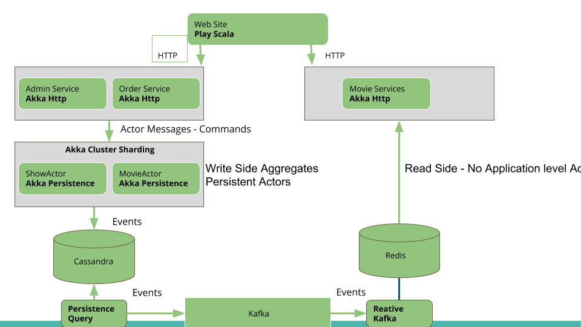

An end to end application to demonstrate the usage of Akka family of frameworks along with event sourcing and CQRS with Akka persistence. It consists of following building blocks

1. A movie booking web site built with Play framework
2. RESTful APIs backing the website built with Akka HTTP
3. Event Sourcing with Persistent Actors backing HTTP APIs. Persistent Actors form the Write side of CQRS
4. Reactive Kafka to subscribe to Events and populate Redis read store

To Run the example
1. Install docker and docker-compose. This is needed as this application runs scylladb, kafka and redis with docker containers
1. sbt stage
2. ./startAll
3. Find your IP address of your system and run following command to initialise the system.
   
   curl -i -X POST  http://<YOUR IP ADDRESS>:8089/init
   
4. In browser go to http://localhost:9000

This application setups multiple components in docker container as following

